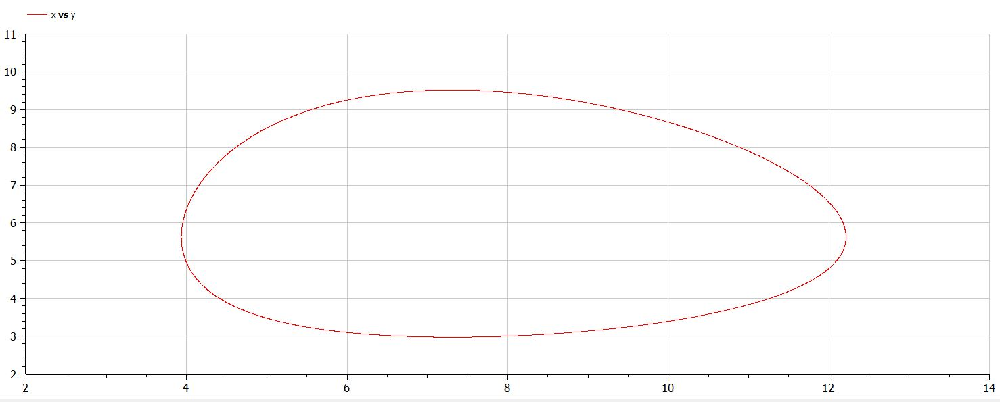

# Лабораторная работа №5
## Ramzi A. Al-Dorikhim
### RUDN University, 2022 Moscow, Russia

---
<!--_class: titleslide1 -->
#### Прагматика выполнения лабораторной работы

При помощи этой модели можно анализировать различные процессы, в том числе экономические и биологические;

Развитие экономики происходит благодаря модели "хищник-жертва";

Модель Лотки-Вольтерры дала старт для описания моделей взаимодействия живых существ и процессов;

Модель "хищник-жертва" хорошо описывает процессы конкуренции между двумя и более субъектами.

---
<!--_class: titleslide2 -->
#### Цель выполнения лабораторной работы
Рассмотреть  модель "хищник-жертва" — модель Лотки-Вольтерры.

---
<!--_class: titleslide2 -->
#### Задача выполнения лабораторной работы

* Построить графики зависимостей:
    x от y;
    x(t) от y(t);
* Найти  стационарное состояние системы.

---
<!--_class: titleslide2 -->
#### Стационарное состоянение системы

Стационарное состояние системы будет в точке: 
$$x_0 = \frac{0.18}{0.032}, y_0 = \frac{0.19}{0.026}$$

---
<!--_class: titleslide4 -->
#### Зависимость изменения численности хищников от изменения численности жертв

#  

---
<!--_class: titleslide4 -->
#### Зависимость изменения численности хищников и численности жертв от времени

#  
---

<!--_class: titleslide2 -->
#### Вывод

* Построили модель "хищник-жертва" Лотки - Вольтерры.

* Построилил следующие графики зависимостей: x от y и x(t) от y(t).

* Нашли стационарное состояние системы.

---
# Спасибо за внимание
